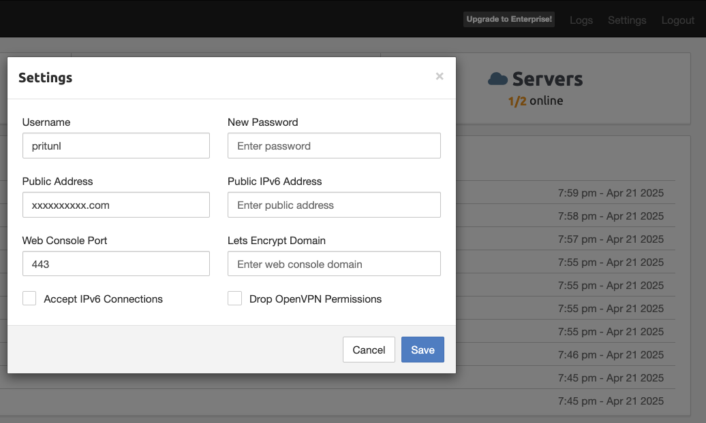
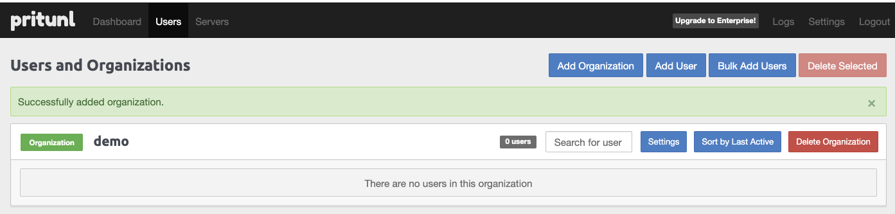
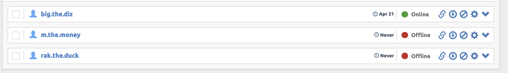
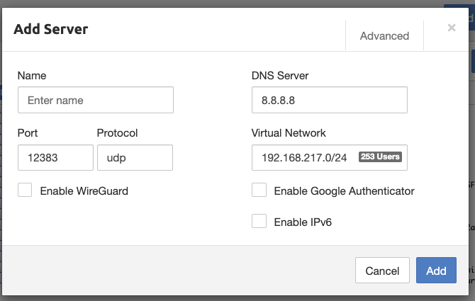
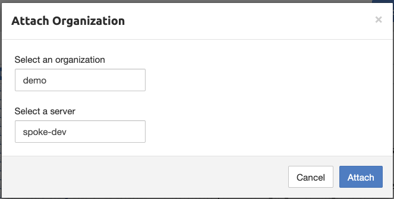
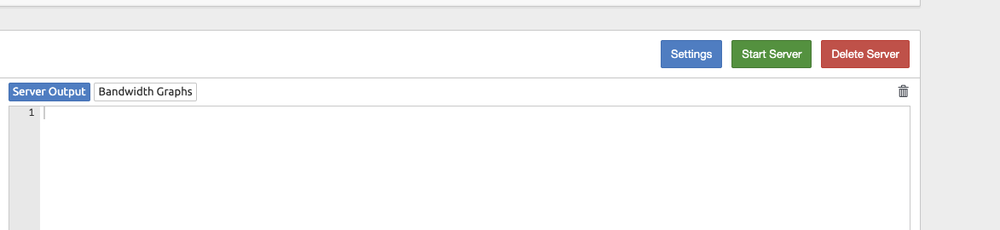

# terraform-aws-pritunl-vpn

## Setting up

0) use example/complete

1) SSM to EC2 running VPN

```sh
sudo pritunl default-password
```

2) access domain setting in var.vpn_route53_records, ignore tls error due to ssc
3) Login with username password from 1)
4) Update config:
- password and save it securely
- Public address from var.vpn_route53_records
- Web console left it as 443



5) Go to User > Add organization (list of people who can access VPN)



6) Add users



7) Go to server and add server

- Beware on Port and Protocol need to match with var.ingress_with_cidr_blocks



Note: After adding server, you can remove route 0.0.0.0/0 and let only interal traffic go under vpn. However you cannot use feature access console from vpn even var.enable_access_console_from_vpn=true

8) Peer Org--Server to gether, will get 1 vpn profile



9) Don't forget to start server



10) Download profile from User and test connectivity

Note: user -vpn-> vpn --> other resource's sg (need to allow ingress from vpn'sg)

11) After setting complete 

`var.enable_access_console_from_public = false`, prevent bruting force access

if var.enable_access_console_from_vpn = false, every time you want to access console
- you must have 443 listener and allow your public ip on `var.ingress_with_cidr_blocks`
- Then, you can remove it

12) You can attach waf to LB

<!-- BEGIN_TF_DOCS -->
## Requirements

| Name | Version |
|------|---------|
| <a name="requirement_terraform"></a> [terraform](#requirement\_terraform) | >= 1.0 |
| <a name="requirement_aws"></a> [aws](#requirement\_aws) | >= 5.79 |

## Providers

| Name | Version |
|------|---------|
| <a name="provider_aws"></a> [aws](#provider\_aws) | >= 5.79 |
| <a name="provider_random"></a> [random](#provider\_random) | n/a |

## Modules

| Name | Source | Version |
|------|--------|---------|
| <a name="module_ec2_private_sg"></a> [ec2\_private\_sg](#module\_ec2\_private\_sg) | terraform-aws-modules/security-group/aws | 5.3.0 |
| <a name="module_ec2_sg"></a> [ec2\_sg](#module\_ec2\_sg) | terraform-aws-modules/security-group/aws | 5.3.0 |
| <a name="module_efs"></a> [efs](#module\_efs) | terraform-aws-modules/efs/aws | 1.8.0 |
| <a name="module_kms"></a> [kms](#module\_kms) | terraform-aws-modules/kms/aws | 3.1.1 |

## Resources

| Name | Type |
|------|------|
| [aws_autoscaling_group.this](https://registry.terraform.io/providers/hashicorp/aws/latest/docs/resources/autoscaling_group) | resource |
| [aws_iam_instance_profile.this](https://registry.terraform.io/providers/hashicorp/aws/latest/docs/resources/iam_instance_profile) | resource |
| [aws_iam_role.this](https://registry.terraform.io/providers/hashicorp/aws/latest/docs/resources/iam_role) | resource |
| [aws_iam_role_policy.this](https://registry.terraform.io/providers/hashicorp/aws/latest/docs/resources/iam_role_policy) | resource |
| [aws_iam_role_policy_attachment.this](https://registry.terraform.io/providers/hashicorp/aws/latest/docs/resources/iam_role_policy_attachment) | resource |
| [aws_launch_template.this](https://registry.terraform.io/providers/hashicorp/aws/latest/docs/resources/launch_template) | resource |
| [aws_lb.private_nlb](https://registry.terraform.io/providers/hashicorp/aws/latest/docs/resources/lb) | resource |
| [aws_lb.this](https://registry.terraform.io/providers/hashicorp/aws/latest/docs/resources/lb) | resource |
| [aws_lb_listener.private_nlb](https://registry.terraform.io/providers/hashicorp/aws/latest/docs/resources/lb_listener) | resource |
| [aws_lb_listener.this](https://registry.terraform.io/providers/hashicorp/aws/latest/docs/resources/lb_listener) | resource |
| [aws_lb_target_group.private_nlb](https://registry.terraform.io/providers/hashicorp/aws/latest/docs/resources/lb_target_group) | resource |
| [aws_lb_target_group.this](https://registry.terraform.io/providers/hashicorp/aws/latest/docs/resources/lb_target_group) | resource |
| [aws_route53_record.private_nlb](https://registry.terraform.io/providers/hashicorp/aws/latest/docs/resources/route53_record) | resource |
| [aws_route53_record.this](https://registry.terraform.io/providers/hashicorp/aws/latest/docs/resources/route53_record) | resource |
| [random_pet.this](https://registry.terraform.io/providers/hashicorp/random/latest/docs/resources/pet) | resource |
| [aws_ami.this](https://registry.terraform.io/providers/hashicorp/aws/latest/docs/data-sources/ami) | data source |
| [aws_caller_identity.current](https://registry.terraform.io/providers/hashicorp/aws/latest/docs/data-sources/caller_identity) | data source |
| [aws_ec2_instance_type.this](https://registry.terraform.io/providers/hashicorp/aws/latest/docs/data-sources/ec2_instance_type) | data source |
| [aws_iam_policy_document.ec2](https://registry.terraform.io/providers/hashicorp/aws/latest/docs/data-sources/iam_policy_document) | data source |
| [aws_iam_policy_document.ec2_assume_role](https://registry.terraform.io/providers/hashicorp/aws/latest/docs/data-sources/iam_policy_document) | data source |
| [aws_vpc.this](https://registry.terraform.io/providers/hashicorp/aws/latest/docs/data-sources/vpc) | data source |

## Inputs

| Name | Description | Type | Default | Required |
|------|-------------|------|---------|:--------:|
| <a name="input_additional_profile_policies"></a> [additional\_profile\_policies](#input\_additional\_profile\_policies) | Map key:value for policy arn to be attached to ec2's role | `map(string)` | `{}` | no |
| <a name="input_azs"></a> [azs](#input\_azs) | AZ using with EFS mounting | `list(string)` | n/a | yes |
| <a name="input_console_route53_records"></a> [console\_route53\_records](#input\_console\_route53\_records) | Map of Route53 records to create. Each record map should contain `zone_id`, `name`, and `type` | `any` | `{}` | no |
| <a name="input_default_ec2_policies"></a> [default\_ec2\_policies](#input\_default\_ec2\_policies) | Map key:value to attach to ec2's role | `map(string)` | <pre>{<br/>  "AmazonSSMManagedInstanceCore": "arn:aws:iam::aws:policy/AmazonSSMManagedInstanceCore"<br/>}</pre> | no |
| <a name="input_default_ec2_spec"></a> [default\_ec2\_spec](#input\_default\_ec2\_spec) | Specification of EC2 that use to run VPN | `any` | <pre>{<br/>  "default_version": null,<br/>  "disable_api_termination": null,<br/>  "ebs_optimized": true,<br/>  "enable_monitoring": true,<br/>  "instance_initiated_shutdown_behavior": "stop",<br/>  "kernel_id": null,<br/>  "ram_disk_id": null,<br/>  "update_default_version": true,<br/>  "volume_size": 20<br/>}</pre> | no |
| <a name="input_ec2_spec"></a> [ec2\_spec](#input\_ec2\_spec) | Specification of EC2 that use to run VPN | `any` | `{}` | no |
| <a name="input_enable_access_console_from_vpn"></a> [enable\_access\_console\_from\_vpn](#input\_enable\_access\_console\_from\_vpn) | Whether allow vpn to access console from vpn | `bool` | `true` | no |
| <a name="input_ingress_with_cidr_blocks"></a> [ingress\_with\_cidr\_blocks](#input\_ingress\_with\_cidr\_blocks) | Ingress use for VPN traffic | `any` | `[]` | no |
| <a name="input_name"></a> [name](#input\_name) | Naming of resource a&& will be use for prefix as sub resources | `string` | n/a | yes |
| <a name="input_nat_public_ips"></a> [nat\_public\_ips](#input\_nat\_public\_ips) | For allow network under vpn manage console, require if enable\_access\_console\_from\_vpn = true | `list(string)` | `[]` | no |
| <a name="input_private_subnet_ids"></a> [private\_subnet\_ids](#input\_private\_subnet\_ids) | Subnet for vpn instance | `list(string)` | n/a | yes |
| <a name="input_public_subnet_ids"></a> [public\_subnet\_ids](#input\_public\_subnet\_ids) | Subnet for NLB | `list(string)` | n/a | yes |
| <a name="input_tags"></a> [tags](#input\_tags) | Map key:value as for tagging resource under this fukcing module | `any` | `{}` | no |
| <a name="input_vpc_id"></a> [vpc\_id](#input\_vpc\_id) | VPC ID where to install | `string` | n/a | yes |
| <a name="input_vpn_route53_records"></a> [vpn\_route53\_records](#input\_vpn\_route53\_records) | Map of Route53 records to create. Each record map should contain `zone_id`, `name`, and `type` | `any` | `{}` | no |
| <a name="input_vpn_storage_s3_force_destroy"></a> [vpn\_storage\_s3\_force\_destroy](#input\_vpn\_storage\_s3\_force\_destroy) | Allow force destroy on vpn config as s3 | `bool` | `false` | no |

## Outputs

No outputs.
<!-- END_TF_DOCS -->
